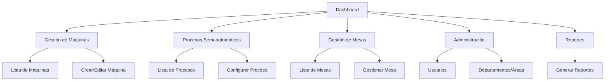

# Documento de Requisitos del Producto - Flexcon Tracker Mejoras

## 1. Descripción General del Producto

Flexcon Tracker es un sistema de seguimiento de producción industrial que permite gestionar departamentos, áreas, máquinas, procesos semi-automáticos y mesas de trabajo. El proyecto requiere mejoras para completar la funcionalidad faltante y migrar de Flux UI a Tailwind CSS.

* El sistema ayuda a las empresas industriales a monitorear y gestionar sus recursos de producción de manera eficiente.

* Los usuarios pueden administrar la estructura organizacional (departamentos, áreas) y los recursos físicos (máquinas, mesas, procesos).

* Proporciona una interfaz web moderna y responsiva para la gestión integral de la producción.

## 2. Características Principales

### 2.1 Roles de Usuario

| Rol           | Método de Registro           | Permisos Principales                                                        |
| ------------- | ---------------------------- | --------------------------------------------------------------------------- |
| Administrador | Registro por invitación      | Acceso completo a todas las funcionalidades, gestión de usuarios y permisos |
| Supervisor    | Asignación por administrador | Gestión de recursos de producción, visualización de reportes                |
| Operador      | Registro estándar            | Acceso de solo lectura a recursos asignados                                 |

### 2.2 Módulo de Características

Nuestros requisitos de mejora consisten en las siguientes páginas principales:

1. **Dashboard**: panel de control principal, estadísticas de producción, navegación rápida.
2. **Gestión de Máquinas**: listado de máquinas, crear/editar máquinas, asignación a áreas.
3. **Procesos Semi-automáticos**: listado de procesos, configuración de procesos, monitoreo de estado.
4. **Gestión de Mesas**: listado de mesas de trabajo, asignación de recursos, estado de ocupación.
5. **Administración de Usuarios**: gestión de usuarios existente mejorada con Tailwind.
6. **Configuración del Sistema**: gestión de departamentos, áreas, roles y permisos mejorada.
7. **Reportes**: visualización de datos de producción, exportación de reportes.

### 2.3 Detalles de Páginas

| Nombre de Página          | Nombre del Módulo     | Descripción de Características                                                                        |
| ------------------------- | --------------------- | ----------------------------------------------------------------------------------------------------- |
| Dashboard                 | Panel Principal       | Mostrar estadísticas de producción, accesos rápidos a módulos principales, notificaciones del sistema |
| Dashboard                 | Navegación            | Sidebar responsivo con Tailwind, menú de usuario, navegación por módulos                              |
| Gestión de Máquinas       | Lista de Máquinas     | Mostrar todas las máquinas con filtros por área/departamento, búsqueda, paginación                    |
| Gestión de Máquinas       | CRUD de Máquinas      | Crear, editar, eliminar máquinas con validación, asignación a áreas                                   |
| Procesos Semi-automáticos | Lista de Procesos     | Mostrar procesos con estado actual, filtros por tipo, búsqueda avanzada                               |
| Procesos Semi-automáticos | CRUD de Procesos      | Crear, editar, eliminar procesos, configuración de parámetros                                         |
| Gestión de Mesas          | Lista de Mesas        | Mostrar mesas con estado de ocupación, asignación de trabajadores                                     |
| Gestión de Mesas          | CRUD de Mesas         | Crear, editar, eliminar mesas, gestión de recursos asignados                                          |
| Administración            | Gestión de Usuarios   | Interfaz mejorada con Tailwind para CRUD de usuarios                                                  |
| Administración            | Departamentos y Áreas | Interfaz migrada a Tailwind para gestión existente                                                    |
| Reportes                  | Visualización         | Generar reportes de producción, gráficos con datos en tiempo real                                     |

## 3. Proceso Principal

El flujo principal del usuario incluye:

**Flujo del Administrador:**

1. Acceso al dashboard principal
2. Configuración inicial de departamentos y áreas
3. Creación y asignación de máquinas a áreas específicas
4. Configuración de procesos semi-automáticos
5. Gestión de mesas de trabajo y asignación de recursos
6. Monitoreo de la producción a través de reportes

**Flujo del Supervisor:**

1. Acceso al dashboard con vista de su área asignada
2. Monitoreo del estado de máquinas y procesos
3. Gestión de mesas de trabajo en su área
4. Generación de reportes de producción

**Flujo del Operador:**

1. Acceso al dashboard con vista limitada
2. Consulta del estado de recursos asignados
3. Visualización de reportes básicos

## 4. Diseño de Interfaz de Usuario

### 4.1 Estilo de Diseño

* **Colores primarios**: Azul (#3B82F6) y gris oscuro (#1F2937)

* **Colores secundarios**: Verde (#10B981) para estados activos, rojo (#EF4444) para alertas

* **Estilo de botones**: Redondeados con sombras sutiles, efectos hover suaves

* **Fuente**: Inter o system fonts, tamaños de 14px a 24px

* **Estilo de layout**: Diseño de tarjetas con sidebar fijo, navegación superior en móvil

* **Iconos**: Heroicons para consistencia con Tailwind

### 4.2 Resumen de Diseño de Páginas

| Nombre de Página          | Nombre del Módulo | Elementos de UI                                                                                  |
| ------------------------- | ----------------- | ------------------------------------------------------------------------------------------------ |
| Dashboard                 | Panel Principal   | Grid de tarjetas con estadísticas, colores azul/verde, tipografía Inter 16px, animaciones suaves |
| Dashboard                 | Sidebar           | Navegación fija con bg-gray-900, iconos blancos, hover effects, responsive collapse              |
| Gestión de Máquinas       | Lista             | Tabla responsiva con filtros, botones azules, badges de estado verde/rojo                        |
| Gestión de Máquinas       | Formularios       | Inputs con border-gray-300, labels en gray-700, botones primarios azules                         |
| Procesos Semi-automáticos | Lista             | Cards con indicadores de estado, colores semáforo, tipografía clara                              |
| Gestión de Mesas          | Vista General     | Layout de grid con cards, indicadores visuales de ocupación                                      |
| Administración            | Formularios       | Diseño consistente con inputs Tailwind, validación visual                                        |
| Reportes                  | Gráficos          | Contenedores blancos con sombras, gráficos con colores corporativos                              |

### 4.3 Responsividad

El producto es desktop-first con adaptación móvil completa. Incluye optimización para interacción táctil en tablets y móviles, con sidebar colapsable y navegación adaptativa.

## 5. Especificaciones Técnicas

### 5.1 Migración de Flux a Tailwind

* Reemplazar todos los componentes `flux:*` con equivalentes en Tailwind CSS

* Mantener la funcionalidad existente de Livewire

* Crear componentes Blade reutilizables con Tailwind

* Asegurar compatibilidad con el sistema de autenticación actual

### 5.2 Implementación de Entidades Faltantes

* **Máquinas**: CRUD completo con relación a áreas, estados operativos

* **Semi-automáticos**: Gestión de procesos con configuración de parámetros

* **Mesas**: Gestión de mesas de trabajo con asignación de recursos

### 5.3 Mejoras de Navegación

* Sidebar responsivo con categorización clara

* Breadcrumbs para navegación contextual

* Búsqueda global en el header

* Notificaciones en tiempo real

