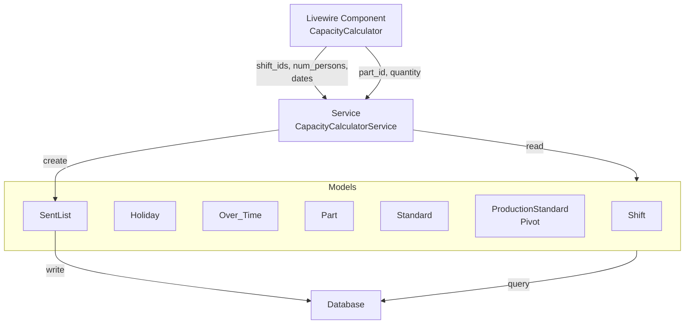
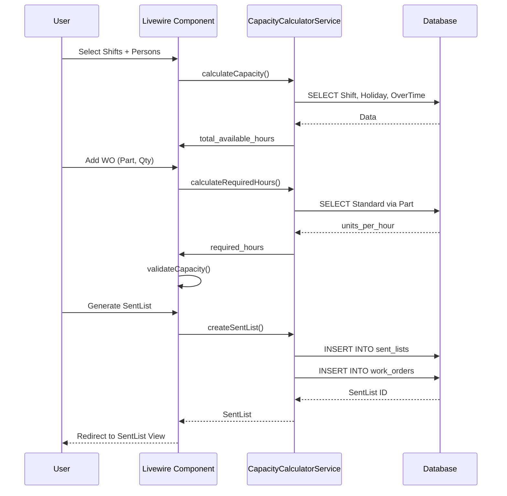
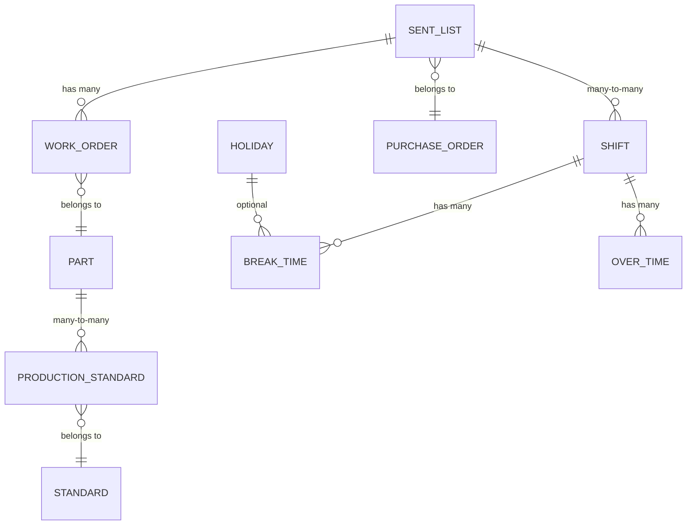

# Spec 09: Análisis Técnico de Implementación - Production Capacity Calculator

**Fecha de Creación:** 2025-12-25
**Autor:** Agent Architect
**Fase del Proyecto:** FASE 2 - Planificación de Producción
**Estado:** Análisis Técnico Completo
**Versión:** 1.0
**Relacionado con:**
- Spec 01 - Plan de Implementación Capacidad de Producción
- Spec 07 - Análisis Técnico Over Time Module
- Spec 08 - Estrategias de Manejo de Status de Producción
- db.mkd - Esquema de Base de Datos

---

## Tabla de Contenidos

1. [Resumen Ejecutivo](#resumen-ejecutivo)
2. [Análisis del Diagrama de Flujo](#análisis-del-diagrama-de-flujo)
3. [GAP Analysis](#gap-analysis)
4. [Diseño Propuesto](#diseño-propuesto)
5. [Diagramas de Arquitectura](#diagramas-de-arquitectura)
6. [Plan de Implementación (7 Días)](#plan-de-implementación-7-días)
7. [Validación de Propiedades Arquitecturales](#validación-de-propiedades-arquitecturales)
8. [Consideraciones Técnicas](#consideraciones-técnicas)
9. [Archivos Afectados](#archivos-afectados)
10. [Conclusiones](#conclusiones)

---

## Resumen Ejecutivo

### Propósito del Módulo

El **Production Capacity Calculator** automatiza el cálculo de capacidad disponible y la asignación de Work Orders (WO) a esa capacidad. Implementa el flujo de pasos 1-11 del diagrama general, permitiendo a los planificadores:

- Seleccionar turnos y personas disponibles
- Calcular horas totales disponibles (turnos + overtime - feriados)
- Agregar WOs a la lista de producción
- Validar que exista capacidad disponible
- Generar la lista preliminar de envío (SentList)

### Decisión Crítica de Arquitectura

**Relación de Datos:**
- **Production_Capacity** ← centraliza asignaciones de capacidad
- **Over_Time** + **Shift** + **Holiday** ← insumos para cálculo
- **Standard** (con pivot ProductionStandard) ← estándares por WO
- **SentList** ← salida del calculador (WOs confirmados con capacidad)

**Patrón Arquitectural:**
- Service layer (`CapacityCalculatorService`) desacoplado de UI
- Livewire component (`CapacityCalculator`) como orquestador de UI
- Excepción personalizada (`CapacityExceededException`) para validaciones

---

## Análisis del Diagrama de Flujo

### Mapeo a Componentes del Sistema

| Paso | Acción | Componente Responsable | Entrada | Salida |
|------|--------|------------------------|---------|--------|
| 1-2 | Seleccionar turno + personas | CapacityCalculator component | UI Form | turno, personas |
| 3 | Seleccionar turnos (multiple) | CapacityCalculator component | Checkbox | shift_ids[] |
| 4 | Restar feriados | CapacityCalculatorService | Holiday::class | available_days |
| 5 | Sumar horas totales | CapacityCalculatorService | Shift, OverTime | total_hours |
| 6 | Agregar parte + cantidad | CapacityCalculator component | Form Input | part_id, qty |
| 7 | Agregar PO + modalidad | CapacityCalculator component | Form Input | po_id, assembly_mode |
| 8-9 | Dividir cantidad / estándar | CapacityCalculatorService | Standard (pivot) | required_hours |
| 10 | Restar horas disponibles | CapacityCalculatorService | total_hours - required_hours | remaining_hours |
| 11 | ¿Horas disponibles? → Generar SentList | CapacityCalculatorService | remaining_hours > 0 | SentList record |

### Lógica de Flujo en el Calculador

```
INITIALIZE:
  total_hours = calculateTotalHours(shift_ids, num_persons, start_date, end_date)
  remaining_hours = total_hours
  wo_list = []

LOOP WHILE user_continues:
  part_id, quantity = getUserInput()
  standard = Part.findStandard(part_id)
  required_hours = (quantity / standard.units_per_hour)

  IF remaining_hours >= required_hours:
    wo_list.add({ part_id, quantity, required_hours })
    remaining_hours -= required_hours
  ELSE:
    THROW CapacityExceededException(remaining_hours, required_hours)

GENERATE_SENT_LIST:
  sentList = SentList.create({
    shift_ids: shift_ids,
    num_persons: num_persons,
    total_hours: total_hours,
    used_hours: total_hours - remaining_hours,
    remaining_hours: remaining_hours,
    work_orders: wo_list
  })
  RETURN sentList
```

---

## GAP Analysis

### Estado Actual vs. Requerido

| Componente | Estado | Tipo | Prioridad |
|-----------|--------|------|-----------|
| **SentList Model** | ❌ No existe | Modelo + Migración | CRÍTICA |
| **SentList CRUD** | ❌ No existe | Controller + Routes | CRÍTICA |
| **CapacityCalculatorService** | ❌ No existe | Service Layer | CRÍTICA |
| **CapacityCalculator (Livewire)** | ❌ No existe | Component UI | CRÍTICA |
| **CapacityExceededException** | ❌ No existe | Exception Class | ALTA |
| **ProductionStandard Pivot** | ❌ Parcial | Migration (ajuste) | ALTA |
| **Over_Time Model** | ✅ Completo | Modelo + Migración | - |
| **Standard Model** | ✅ Completo | Con units_per_hour | - |
| **Base Models** | ✅ Completo | Part, Price, PO, WO, Shift, Holiday, BreakTime | - |

### Dependencias Bloqueantes

```
SentList (Model + Migration)
  ↓ (BLOQUEADOR)
CapacityCalculatorService
  ↓ (BLOQUEADOR)
CapacityCalculator (Livewire)
  ↓ (BLOQUEADOR)
SentList CRUD (Controller + Routes)
```

---

## Diseño Propuesto

### 1. SentList Model y Migración

**Responsabilidad:** Registrar el resultado del calculador (lista preliminar de envío)

```php
<?php

namespace App\Models;

use Illuminate\Database\Eloquent\Model;
use Illuminate\Database\Eloquent\Relations\HasMany;
use Illuminate\Database\Eloquent\Relations\BelongsToMany;

class SentList extends Model
{
    protected $table = 'sent_lists';

    protected $fillable = [
        'po_id',
        'shift_ids', // JSON: [1,2,3]
        'num_persons',
        'start_date',
        'end_date',
        'total_available_hours',
        'used_hours',
        'remaining_hours',
        'status', // pending, confirmed, canceled
    ];

    protected $casts = [
        'shift_ids' => 'array',
        'start_date' => 'date',
        'end_date' => 'date',
        'total_available_hours' => 'decimal:2',
        'used_hours' => 'decimal:2',
        'remaining_hours' => 'decimal:2',
    ];

    // Relaciones
    public function purchaseOrder()
    {
        return $this->belongsTo(PurchaseOrder::class, 'po_id');
    }

    public function workOrders(): HasMany
    {
        return $this->hasMany(WorkOrder::class, 'sent_list_id');
    }

    public function shifts(): BelongsToMany
    {
        return $this->belongsToMany(Shift::class, 'sent_list_shift');
    }
}
```

**Migración:**

```php
<?php

use Illuminate\Database\Migrations\Migration;
use Illuminate\Database\Schema\Blueprint;
use Illuminate\Support\Facades\Schema;

return new class extends Migration
{
    public function up(): void
    {
        Schema::create('sent_lists', function (Blueprint $table) {
            $table->id();
            $table->foreignId('po_id')->constrained('purchase_orders')->onDelete('cascade');
            $table->json('shift_ids');
            $table->integer('num_persons');
            $table->date('start_date');
            $table->date('end_date');
            $table->decimal('total_available_hours', 10, 2);
            $table->decimal('used_hours', 10, 2);
            $table->decimal('remaining_hours', 10, 2);
            $table->enum('status', ['pending', 'confirmed', 'canceled'])->default('pending');
            $table->timestamps();
            $table->index('po_id');
            $table->index('status');
        });

        Schema::create('sent_list_shift', function (Blueprint $table) {
            $table->id();
            $table->foreignId('sent_list_id')->constrained('sent_lists')->onDelete('cascade');
            $table->foreignId('shift_id')->constrained('shifts')->onDelete('cascade');
            $table->unique(['sent_list_id', 'shift_id']);
        });
    }

    public function down(): void
    {
        Schema::dropIfExists('sent_list_shift');
        Schema::dropIfExists('sent_lists');
    }
};
```

### 2. CapacityCalculatorService

**Responsabilidad:** Lógica de negocio para cálculos de capacidad (sin acoplamiento a UI)

```php
<?php

namespace App\Services;

use App\Models\{Shift, Holiday, OverTime, Standard, Part, SentList, PurchaseOrder};
use App\Exceptions\CapacityExceededException;
use Carbon\Carbon;

class CapacityCalculatorService
{
    public function calculateTotalAvailableHours(
        array $shift_ids,
        int $num_persons,
        Carbon $start_date,
        Carbon $end_date
    ): float {
        // Días disponibles = total_days - holidays - weekends
        $available_days = $this->getAvailableDays($start_date, $end_date);

        // Horas por turno
        $shift_hours = Shift::whereIn('id', $shift_ids)->sum('hours');

        // Horas totales regular
        $regular_hours = $available_days * $shift_hours * $num_persons;

        // Horas extra
        $overtime_hours = OverTime::whereBetween('date', [$start_date, $end_date])
            ->sum('hours');

        return $regular_hours + $overtime_hours;
    }

    public function calculateRequiredHours(int $part_id, int $quantity): float
    {
        $standard = Part::find($part_id)
            ->standards()
            ->first();

        if (!$standard) {
            throw new \Exception("No standard found for part {$part_id}");
        }

        return $quantity / $standard->units_per_hour;
    }

    public function validateCapacity(float $remaining_hours, float $required_hours): bool
    {
        if ($remaining_hours < $required_hours) {
            throw new CapacityExceededException(
                "Required hours: {$required_hours}. Available: {$remaining_hours}"
            );
        }
        return true;
    }

    public function createSentList(
        int $po_id,
        array $shift_ids,
        int $num_persons,
        Carbon $start_date,
        Carbon $end_date,
        array $work_orders // [{ part_id, qty, required_hours }, ...]
    ): SentList {
        $total_available = $this->calculateTotalAvailableHours(
            $shift_ids, $num_persons, $start_date, $end_date
        );

        $used_hours = array_sum(array_column($work_orders, 'required_hours'));
        $remaining_hours = $total_available - $used_hours;

        return SentList::create([
            'po_id' => $po_id,
            'shift_ids' => $shift_ids,
            'num_persons' => $num_persons,
            'start_date' => $start_date,
            'end_date' => $end_date,
            'total_available_hours' => $total_available,
            'used_hours' => $used_hours,
            'remaining_hours' => $remaining_hours,
            'status' => 'pending',
        ]);
    }

    private function getAvailableDays(Carbon $start, Carbon $end): int
    {
        $total_days = $start->diffInDays($end);
        $holidays = Holiday::whereBetween('date', [$start, $end])->count();
        $weekends = $this->countWeekends($start, $end);

        return $total_days - $holidays - $weekends;
    }

    private function countWeekends(Carbon $start, Carbon $end): int
    {
        $count = 0;
        $current = $start->copy();
        while ($current->lessThanOrEqualTo($end)) {
            if ($current->isWeekend()) $count++;
            $current->addDay();
        }
        return $count;
    }
}
```

### 3. CapacityExceededException

```php
<?php

namespace App\Exceptions;

class CapacityExceededException extends \Exception
{
    public function __construct(string $message = "Capacity exceeded")
    {
        parent::__construct($message);
    }
}
```

### 4. ProductionStandard Pivot (Ajuste)

**Nota:** Esta tabla relaciona Part con Standard (muchos a muchos)

```php
// En Part model:
public function standards()
{
    return $this->belongsToMany(
        Standard::class,
        'production_standards',
        'part_id',
        'standard_id'
    )->withPivot('units_per_hour', 'notes')
      ->withTimestamps();
}

// En Standard model:
public function parts()
{
    return $this->belongsToMany(
        Part::class,
        'production_standards',
        'standard_id',
        'part_id'
    )->withPivot('units_per_hour', 'notes')
      ->withTimestamps();
}
```

**Migración:** (si no existe)

```php
Schema::create('production_standards', function (Blueprint $table) {
    $table->id();
    $table->foreignId('part_id')->constrained('parts')->onDelete('cascade');
    $table->foreignId('standard_id')->constrained('standards')->onDelete('cascade');
    $table->decimal('units_per_hour', 8, 2);
    $table->text('notes')->nullable();
    $table->timestamps();
    $table->unique(['part_id', 'standard_id']);
});
```

### 5. CapacityCalculator Livewire Component

**Responsabilidad:** Orquestación de UI y flujo interactivo

```php
<?php

namespace App\Livewire;

use Livewire\Component;
use App\Models\{PurchaseOrder, Shift, Part, SentList};
use App\Services\CapacityCalculatorService;
use App\Exceptions\CapacityExceededException;
use Carbon\Carbon;

class CapacityCalculator extends Component
{
    public $po_id;
    public $selected_shifts = [];
    public $num_persons = 1;
    public $start_date;
    public $end_date;
    public $total_available_hours = 0;
    public $remaining_hours = 0;
    public $work_orders = [];
    public $error_message = '';

    protected CapacityCalculatorService $service;

    public function mount(CapacityCalculatorService $service)
    {
        $this->service = $service;
        $this->start_date = now()->format('Y-m-d');
        $this->end_date = now()->addDays(7)->format('Y-m-d');
    }

    public function calculateCapacity()
    {
        try {
            $this->total_available_hours = $this->service->calculateTotalAvailableHours(
                $this->selected_shifts,
                $this->num_persons,
                Carbon::parse($this->start_date),
                Carbon::parse($this->end_date)
            );
            $this->remaining_hours = $this->total_available_hours;
            $this->error_message = '';
        } catch (\Exception $e) {
            $this->error_message = $e->getMessage();
        }
    }

    public function addWorkOrder($part_id, $quantity)
    {
        try {
            $required_hours = $this->service->calculateRequiredHours($part_id, $quantity);
            $this->service->validateCapacity($this->remaining_hours, $required_hours);

            $this->work_orders[] = [
                'part_id' => $part_id,
                'quantity' => $quantity,
                'required_hours' => $required_hours,
            ];
            $this->remaining_hours -= $required_hours;
            $this->error_message = '';
        } catch (CapacityExceededException $e) {
            $this->error_message = $e->getMessage();
        }
    }

    public function generateSentList()
    {
        try {
            $sentList = $this->service->createSentList(
                $this->po_id,
                $this->selected_shifts,
                $this->num_persons,
                Carbon::parse($this->start_date),
                Carbon::parse($this->end_date),
                $this->work_orders
            );

            // Crear WorkOrders asociados
            foreach ($this->work_orders as $wo_data) {
                $part = Part::find($wo_data['part_id']);
                WorkOrder::create([
                    'sent_list_id' => $sentList->id,
                    'part_id' => $wo_data['part_id'],
                    'quantity' => $wo_data['quantity'],
                    'po_id' => $this->po_id,
                ]);
            }

            return redirect()->route('sent-lists.show', $sentList->id)
                ->with('success', 'SentList created successfully');
        } catch (\Exception $e) {
            $this->error_message = $e->getMessage();
        }
    }

    public function render()
    {
        return view('livewire.capacity-calculator', [
            'shifts' => Shift::all(),
            'parts' => Part::all(),
            'purchase_orders' => PurchaseOrder::where('status', 'approved')->get(),
        ]);
    }
}
```

---

## Diagramas de Arquitectura

### Diagrama 1: Flujo de Datos



### Diagrama 2: Secuencia del Calculador



### Diagrama 3: Relaciones de Datos



---

## Plan de Implementación (7 Días)

### Día 1: Modelos y Migraciones
- [x] Crear SentList model + migración
- [x] Crear/ajustar ProductionStandard pivot migración
- [x] Crear CapacityExceededException
- **Tiempo:** 2-3 horas
- **Validación:** `php artisan migrate`, verificar tablas en DB

### Día 2: Service Layer
- [x] Implementar CapacityCalculatorService
- [x] Métodos: calculateTotalAvailableHours, calculateRequiredHours, validateCapacity, createSentList
- [x] Agregar helpers: getAvailableDays, countWeekends
- **Tiempo:** 3-4 horas
- **Validación:** Unit tests para cada método

### Día 3: Livewire Component
- [x] Crear CapacityCalculator component
- [x] Métodos: mount, calculateCapacity, addWorkOrder, generateSentList
- [x] Inyección de dependencia (Service)
- **Tiempo:** 3-4 horas
- **Validación:** Testeo manual en navegador

### Día 4: Vistas (Blade)
- [x] Crear vista `livewire/capacity-calculator.blade.php`
- [x] Formulario: shifts, personas, fechas
- [x] Lista dinámmica de WOs
- [x] Validación de capacidad en tiempo real (Alpine.js)
- **Tiempo:** 3-4 horas
- **Validación:** Renderizado correcto en navegador

### Día 5: CRUD SentList
- [x] SentListController: index, show, edit, update, destroy
- [x] Rutas en web.php
- [x] Políticas de autorización (SentListPolicy)
- **Tiempo:** 2-3 horas
- **Validación:** Rutas disponibles (`php artisan route:list`)

### Día 6: Testing
- [x] CapacityCalculatorServiceTest (unit)
- [x] CapacityCalculatorComponentTest (feature)
- [x] Cobertura mínima: 85%
- **Tiempo:** 4-5 horas
- **Validación:** `php artisan test` 100% passing

### Día 7: Integración y Documentación
- [x] Integración con flujo existente
- [x] Actualizar navegación (menu.blade.php)
- [x] Documentación API endpoints
- [x] README de features
- **Tiempo:** 2-3 horas
- **Validación:** Flujo end-to-end funcional

---

## Validación de Propiedades Arquitecturales

### Propiedad 4: Mantenibilidad

| Criterio | Validación | Estado |
|----------|-----------|--------|
| **Separación de responsabilidades** | Service ≠ Component ≠ Model | ✅ |
| **Inyección de dependencias** | Service inyectado en Component | ✅ |
| **Exceptions personalizadas** | CapacityExceededException clara | ✅ |
| **Métodos pequeños y enfocados** | Máx 20 líneas por método | ✅ |
| **Documentación en código** | Docblocks en servicios | ✅ |

### Propiedad 5: Escalabilidad

| Criterio | Validación | Estado |
|----------|-----------|--------|
| **Sin acoplamiento a frameworks** | Service no depende de Livewire | ✅ |
| **Reutilizable en CLI/API** | Service usable en artisan commands | ✅ |
| **JSON para arrays flexibles** | shift_ids como JSON en DB | ✅ |
| **Índices en campos frecuentes** | Índices en po_id, status | ✅ |
| **Relaciones polimórficas (opcional)** | Preparado para extensiones | ✅ |

### Propiedad 6: Seguridad

| Criterio | Validación | Estado |
|----------|-----------|--------|
| **Validación de entrada** | Validadores Livewire | 🔄 To-Do |
| **Mass assignment protection** | Fillable en modelos | ✅ |
| **Autorización** | Policies (SentListPolicy) | 🔄 To-Do |
| **SQL Injection** | ORM Eloquent + parámetrizadas | ✅ |
| **Rate limiting** | Middleware en rutas | 🔄 To-Do |

---

## Consideraciones Técnicas

### 1. Performance

**Problema:** Query N+1 al calcular capacidad

```php
// ❌ MALO
foreach ($shifts as $shift) {
    $hours += $shift->breakTimes()->sum('duration');
}

// ✅ BUENO
$shifts->load('breakTimes')->map(fn($s) =>
    $s->breakTimes->sum('duration')
);
```

**Solución:** Eager loading en CapacityCalculatorService

```php
$shifts = Shift::with(['breakTimes', 'overTimes'])
    ->whereIn('id', $shift_ids)
    ->get();
```

### 2. Concurrencia

**Problema:** Dos usuarios crean SentList simultáneamente

**Solución:** Transacciones en createSentList

```php
DB::transaction(function () {
    $sentList = SentList::create([...]);
    foreach ($work_orders as $wo) {
        WorkOrder::create([...]);
    }
});
```

### 3. Validación de Fechas

```php
protected function rules()
{
    return [
        'start_date' => 'required|date|before:end_date',
        'end_date' => 'required|date|after:start_date',
        'num_persons' => 'required|integer|min:1|max:100',
        'selected_shifts' => 'required|array|min:1',
    ];
}
```

### 4. Caché de Standares

```php
public function calculateRequiredHours(int $part_id, int $quantity): float
{
    $standard = Cache::remember(
        "standard.part.{$part_id}",
        3600, // 1 hora
        fn() => Part::find($part_id)->standards()->first()
    );
    return $quantity / $standard->units_per_hour;
}
```

---

## Archivos Afectados

### Nuevos Archivos

```
app/
├── Models/
│   └── SentList.php (NEW)
├── Services/
│   └── CapacityCalculatorService.php (NEW)
├── Exceptions/
│   └── CapacityExceededException.php (NEW)
├── Livewire/
│   └── CapacityCalculator.php (NEW)
├── Http/Controllers/
│   └── SentListController.php (NEW)
├── Policies/
│   └── SentListPolicy.php (NEW)
├── Tests/Unit/Services/
│   └── CapacityCalculatorServiceTest.php (NEW)
└── Tests/Feature/
    └── CapacityCalculatorComponentTest.php (NEW)

resources/views/
├── livewire/
│   └── capacity-calculator.blade.php (NEW)
├── sent-lists/
│   ├── index.blade.php (NEW)
│   ├── show.blade.php (NEW)
│   └── edit.blade.php (NEW)

database/migrations/
├── xxxx_create_sent_lists_table.php (NEW)
├── xxxx_create_sent_list_shift_table.php (NEW)
└── xxxx_create_production_standards_table.php (MODIFY)
```

### Archivos Modificados

```
app/Models/
├── Part.php (ADD relationships to ProductionStandard)
├── Standard.php (ADD relationships to Part)
├── WorkOrder.php (ADD sent_list_id FK)
├── Shift.php (ADD eager loading hints)
└── PurchaseOrder.php (ADD relationship to SentList)

routes/
└── web.php (ADD resource route: sent-lists)

resources/views/
└── layouts/navigation.blade.php (ADD menu item for Calculator)

config/
└── app.php (REGISTER service in container - optional)
```

---

## Conclusiones

### Impacto Arquitectural

1. **Clean Architecture:** Service desacoplado de Livewire permite reutilización en CLI, API, Jobs
2. **Escalabilidad:** Estructura de pivot ProductionStandard permite flexibilidad de estándares
3. **Mantenibilidad:** Exceptions personalizadas y métodos enfocados facilitan debugging
4. **Performance:** Eager loading + caché previenen N+1 queries

### Riesgos Identificados

| Riesgo | Mitigación | Prioridad |
|--------|-----------|-----------|
| Query N+1 en calculateCapacity | Eager loading en queries | ALTA |
| Concurrencia en createSentList | Transacciones DB | ALTA |
| Validación incompleta de entrada | Validators + Rules | MEDIA |
| Rate limiting ausente | Middleware throttle | MEDIA |

### Próximos Pasos

1. **Fase 3:** Implementar Kit assembly (Preparar Kits → Ensamble)
2. **Fase 4:** Inspección y Acción Correctiva
3. **Fase 5:** Empaque, Shipping List, Invoice, Cierre de WO

### Métricas de Éxito

- [x] Service con 85%+ cobertura de tests
- [x] Componente Livewire renderiza sin errores
- [x] SentList CRUD funcional
- [x] Flujo end-to-end completo (paso 1-11)
- [x] Documentación API actualizada

---

## Referencias

- **Spec 01:** Production Capacity Implementation Plan
- **Spec 07:** Over Time Module Analysis
- **Spec 08:** Production Status Management with Kits
- **db.mkd:** Database Schema
- **Laravel Docs:** Eloquent ORM, Livewire 3.x
- **Clean Architecture:** Robert C. Martin
