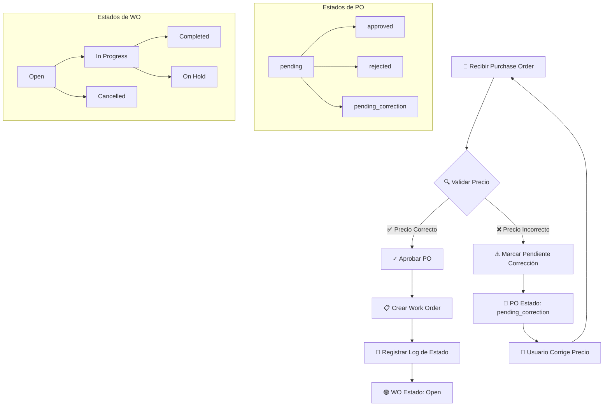
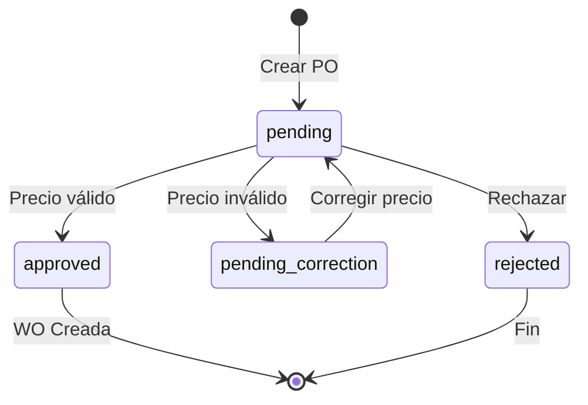
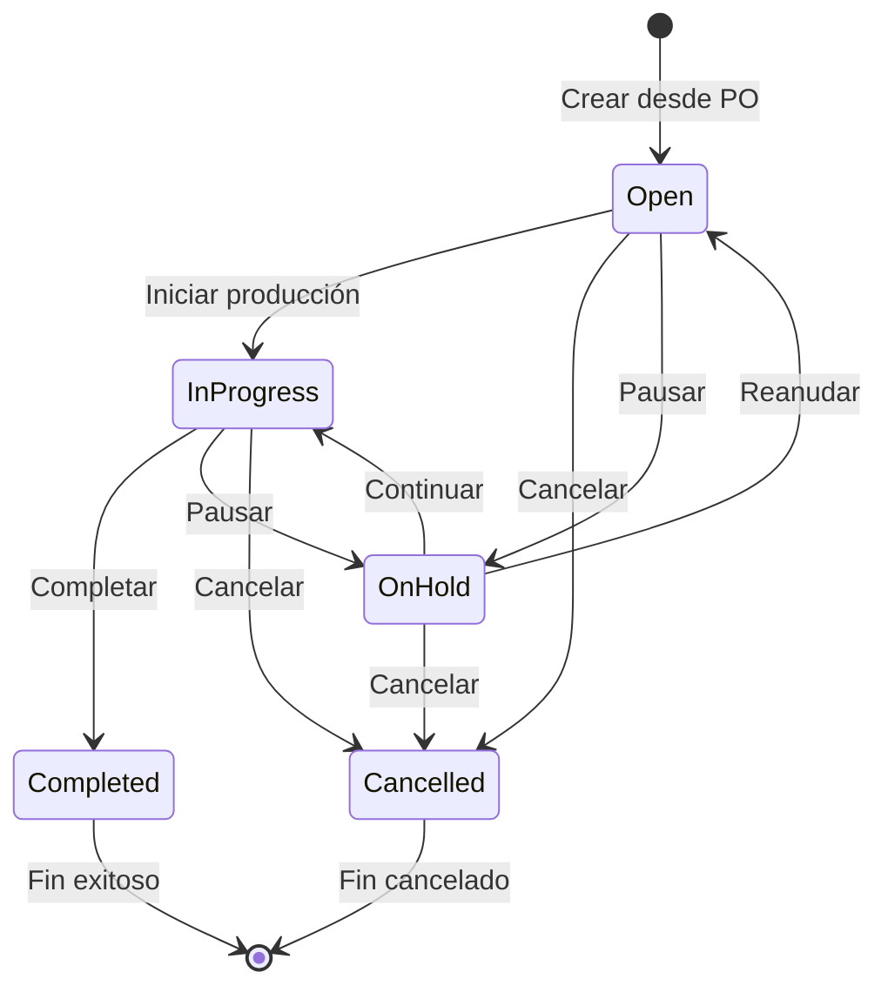
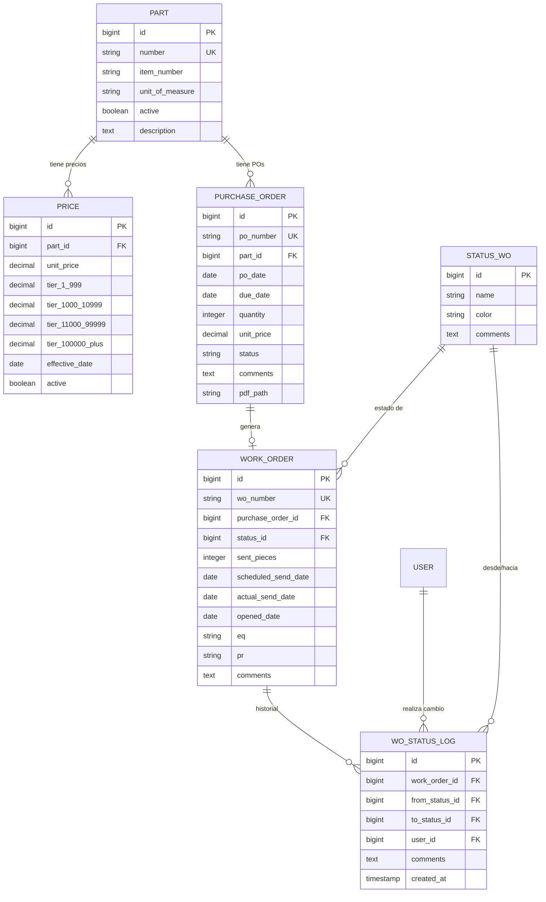

# Documentación Fase 1: Fundamentos de Órdenes

## Índice
1. [Resumen General](#resumen-general)
2. [Diagrama de Flujo](#diagrama-de-flujo)
3. [Módulos Implementados](#módulos-implementados)
4. [Modelos y Relaciones](#modelos-y-relaciones)
5. [Servicios](#servicios)
6. [Rutas y Componentes](#rutas-y-componentes)
7. [Estados del Sistema](#estados-del-sistema)
8. [Escenarios de Prueba](#escenarios-de-prueba)

---

## Resumen General

La **Fase 1** establece el flujo básico desde la recepción de una **Purchase Order (PO)** hasta la creación de una **Work Order (WO)**. Este es el fundamento del sistema ERP de FlexCon Tracker.

### Objetivo Principal
Gestionar el ciclo de vida de las órdenes de compra, validar precios automáticamente y generar órdenes de trabajo cuando las POs son aprobadas.

### Flujo Principal
```
Recibir PO → Validar Precio → ¿Precio OK? → Aprobar PO → Crear WO
                                  ↓ NO
                         Marcar como "Pendiente Corrección"
```

---

## Diagrama de Flujo



---

## Módulos Implementados

### 1. 📦 Parts (Partes)
**Ubicación:** `app/Models/Part.php`

Catálogo de productos/partes que se pueden fabricar.

| Campo | Tipo | Descripción |
|-------|------|-------------|
| id | bigint | Identificador único |
| number | string | Número de parte (único) |
| item_number | string | Número de ítem |
| unit_of_measure | string | Unidad de medida (PCS, KG, etc.) |
| active | boolean | Si la parte está activa |
| description | text | Descripción del producto |
| notes | text | Notas adicionales |

**Relaciones:**
- `hasMany` → Price (precios)
- `hasMany` → PurchaseOrder (órdenes de compra)

---

### 2. 💰 Prices (Precios)
**Ubicación:** `app/Models/Price.php`

Sistema de precios por volumen con tiers.

| Campo | Tipo | Descripción |
|-------|------|-------------|
| id | bigint | Identificador único |
| part_id | foreignId | Relación con Part |
| unit_price | decimal(10,4) | Precio unitario base |
| tier_1_999 | decimal(10,4) | Precio para 1-999 unidades |
| tier_1000_10999 | decimal(10,4) | Precio para 1,000-10,999 unidades |
| tier_11000_99999 | decimal(10,4) | Precio para 11,000-99,999 unidades |
| tier_100000_plus | decimal(10,4) | Precio para 100,000+ unidades |
| effective_date | date | Fecha de vigencia |
| active | boolean | Si el precio está activo |

**Método Principal:**
```php
// Obtiene el precio correcto según la cantidad
$price->getPriceForQuantity(int $quantity): ?float
```

**Lógica de Selección de Tier:**
```
Cantidad >= 100,000  → tier_100000_plus
Cantidad 11,000-99,999 → tier_11000_99999
Cantidad 1,000-10,999 → tier_1000_10999
Cantidad 1-999 → tier_1_999
Fallback → unit_price
```

---

### 3. 🗂️ StatusWO (Estados de Work Order)
**Ubicación:** `app/Models/StatusWO.php`
**Tabla:** `statuses_wo`

Catálogo de estados disponibles para Work Orders.

| Campo | Tipo | Descripción |
|-------|------|-------------|
| id | bigint | Identificador único |
| name | string | Nombre del estado |
| color | string | Color hexadecimal para UI |
| comments | text | Descripción del estado |

**Estados Predefinidos:**

| Estado | Color | Descripción |
|--------|-------|-------------|
| 🔵 Open | #3B82F6 | WO abierta, lista para procesar |
| 🟡 In Progress | #F59E0B | WO en proceso de producción |
| 🟢 Completed | #10B981 | WO completada exitosamente |
| 🔴 Cancelled | #EF4444 | WO cancelada |
| ⚫ On Hold | #6B7280 | WO en espera |

---

### 4. 📄 PurchaseOrder (Órdenes de Compra)
**Ubicación:** `app/Models/PurchaseOrder.php`

Órdenes de compra recibidas del cliente.

| Campo | Tipo | Descripción |
|-------|------|-------------|
| id | bigint | Identificador único |
| po_number | string | Número de PO (único) |
| part_id | foreignId | Relación con Part |
| po_date | date | Fecha de la PO |
| due_date | date | Fecha de entrega |
| quantity | integer | Cantidad solicitada |
| unit_price | decimal(10,4) | Precio unitario en la PO |
| status | string | Estado actual |
| comments | text | Comentarios |
| pdf_path | string | Ruta al PDF adjunto |

**Estados de PO:**

| Estado | Constante | Descripción |
|--------|-----------|-------------|
| pending | STATUS_PENDING | Pendiente de revisión |
| approved | STATUS_APPROVED | Aprobada, WO creada |
| rejected | STATUS_REJECTED | Rechazada |
| pending_correction | STATUS_PENDING_CORRECTION | Precio incorrecto |

**Relaciones:**
- `belongsTo` → Part
- `hasOne` → WorkOrder

---

### 5. 📋 WorkOrder (Órdenes de Trabajo)
**Ubicación:** `app/Models/WorkOrder.php`

Órdenes de trabajo generadas internamente para producción.

| Campo | Tipo | Descripción |
|-------|------|-------------|
| id | bigint | Identificador único |
| wo_number | string | Número de WO (único, formato: WO-YYYY-XXXXX) |
| purchase_order_id | foreignId | Relación con PurchaseOrder |
| status_id | foreignId | Relación con StatusWO |
| sent_pieces | integer | Piezas enviadas |
| scheduled_send_date | date | Fecha programada de envío |
| actual_send_date | date | Fecha real de envío |
| opened_date | date | Fecha de apertura |
| eq | string | Equipo asignado |
| pr | string | Personal asignado |
| comments | text | Comentarios |

**Formato de WO Number:**
```
WO-2025-00001
WO-2025-00002
...
WO-2025-99999
```

**Atributos Calculados:**
- `original_quantity` → Cantidad de la PO asociada
- `pending_quantity` → original_quantity - sent_pieces

**Relaciones:**
- `belongsTo` → PurchaseOrder
- `belongsTo` → StatusWO
- `hasMany` → WOStatusLog
- `hasMany` → Lot (Fase 3)
- `hasMany` → SentList (Fase 2)

---

### 6. 📝 WOStatusLog (Log de Cambios de Estado)
**Ubicación:** `app/Models/WOStatusLog.php`
**Tabla:** `wo_status_logs`

Historial de cambios de estado de las Work Orders.

| Campo | Tipo | Descripción |
|-------|------|-------------|
| id | bigint | Identificador único |
| work_order_id | foreignId | Relación con WorkOrder |
| from_status_id | foreignId | Estado anterior (nullable) |
| to_status_id | foreignId | Estado nuevo |
| user_id | foreignId | Usuario que hizo el cambio |
| comments | text | Comentarios del cambio |
| created_at | timestamp | Fecha/hora del cambio |

**Relaciones:**
- `belongsTo` → WorkOrder
- `belongsTo` → StatusWO (fromStatus)
- `belongsTo` → StatusWO (toStatus)
- `belongsTo` → User

---

## Servicios

### PurchaseOrderService
**Ubicación:** `app/Services/PurchaseOrderService.php`

Servicio principal para la lógica de negocio de POs y WOs.

#### Métodos Principales:

```php
// Valida el precio de una PO contra el precio registrado
validatePrice(PurchaseOrder $po): array
// Retorna: ['valid' => bool, 'expected_price' => float|null, 'message' => string]

// Marca una PO como pendiente de corrección
markAsPendingCorrection(PurchaseOrder $po, string $reason): PurchaseOrder

// Aprueba una PO (solo si el precio es válido)
approve(PurchaseOrder $po): array

// Rechaza una PO
reject(PurchaseOrder $po, ?string $reason): PurchaseOrder

// Crea una WO desde una PO aprobada
createFromPO(PurchaseOrder $po): array

// Aprueba PO y crea WO automáticamente
approveAndCreateWO(PurchaseOrder $po): array

// Actualiza el estado de una WO con logging
updateWorkOrderStatus(WorkOrder $wo, int $newStatusId, ?string $comments): WorkOrder
```

#### Flujo de `approveAndCreateWO()`:
```
1. Validar precio de la PO
2. Si precio inválido → marcar como pending_correction
3. Si precio válido → cambiar status a approved
4. Generar WO number único
5. Crear WorkOrder con status "Open"
6. Crear WOStatusLog inicial
7. Retornar resultado
```

---

## Rutas y Componentes

### Rutas de Purchase Orders
| Método | URI | Componente | Nombre |
|--------|-----|------------|--------|
| GET | /admin/purchase-orders | POList | admin.purchase-orders.index |
| GET | /admin/purchase-orders/create | POCreate | admin.purchase-orders.create |
| GET | /admin/purchase-orders/{po} | POShow | admin.purchase-orders.show |
| GET | /admin/purchase-orders/{po}/edit | POEdit | admin.purchase-orders.edit |

### Rutas de Work Orders
| Método | URI | Componente | Nombre |
|--------|-----|------------|--------|
| GET | /admin/work-orders | WOList | admin.work-orders.index |
| GET | /admin/work-orders/{wo} | WOShow | admin.work-orders.show |
| GET | /admin/work-orders/{wo}/edit | WOEdit | admin.work-orders.edit |

### Componentes Livewire

#### Purchase Orders (`app/Livewire/Admin/PurchaseOrders/`)
- **POList** - Lista con filtros, búsqueda, aprobación/rechazo
- **POCreate** - Formulario de creación con validación de precio en tiempo real
- **POShow** - Detalle con validación de precio y acciones
- **POEdit** - Edición de PO (solo si no tiene WO)

#### Work Orders (`app/Livewire/Admin/WorkOrders/`)
- **WOList** - Lista con filtros por estado y fecha
- **WOShow** - Detalle con progreso y historial de estados
- **WOEdit** - Edición de campos y cambio de estado

---

## Estados del Sistema

### Diagrama de Transición de Estados - PO



### Diagrama de Transición de Estados - WO



---

## Escenarios de Prueba

El seeder `WorkOrderTestSeeder` crea 5 escenarios para verificar el flujo:

### Escenario 1: Flujo Exitoso ✅
```
PO-TEST-001 → Precio correcto ($1.50) → Aprobada → WO-2025-00001 (Open)
```

### Escenario 2: Error de Precio ❌
```
PO-TEST-002 → Precio incorrecto ($1.75 vs $2.00 esperado) → pending_correction
```

### Escenario 3: PO Rechazada ❌
```
PO-TEST-003 → Rechazada manualmente → rejected (sin WO)
```

### Escenario 4: WO En Progreso 🔄
```
PO-TEST-004 → Aprobada → WO-2025-00004 (In Progress, 500/1000 piezas)
```

### Escenario 5: WO Completada ✅
```
PO-TEST-005 → Aprobada → WO-2025-00005 (Completed, 2000/2000 piezas)
```

### Ejecutar Seeder:
```bash
php artisan db:seed --class=WorkOrderTestSeeder
```

---

## Diagrama Entidad-Relación



---

## Archivos de la Fase 1

### Migraciones
```
database/migrations/
├── 2025_12_10_051116_create_parts_table.php
├── 2025_12_10_060000_create_statuses_wo_table.php
├── 2025_12_10_070000_create_prices_table.php
├── 2025_12_10_080000_create_purchase_orders_table.php
├── 2025_12_10_090000_create_work_orders_table.php
└── 2025_12_10_090001_create_wo_status_logs_table.php
```

### Modelos
```
app/Models/
├── Part.php
├── Price.php
├── StatusWO.php
├── PurchaseOrder.php
├── WorkOrder.php
└── WOStatusLog.php
```

### Servicios
```
app/Services/
└── PurchaseOrderService.php
```

### Componentes Livewire
```
app/Livewire/Admin/
├── PurchaseOrders/
│   ├── POList.php
│   ├── POCreate.php
│   ├── POShow.php
│   └── POEdit.php
├── WorkOrders/
│   ├── WOList.php
│   ├── WOShow.php
│   └── WOEdit.php
├── StatusesWO/
│   ├── StatusWOList.php
│   ├── StatusWOCreate.php
│   └── StatusWOEdit.php
├── Parts/
│   ├── PartList.php
│   ├── PartCreate.php
│   ├── PartShow.php
│   └── PartEdit.php
└── Prices/
    ├── PriceList.php
    ├── PriceCreate.php
    └── PriceEdit.php
```

### Vistas
```
resources/views/livewire/admin/
├── purchase-orders/
│   ├── po-list.blade.php
│   ├── po-create.blade.php
│   ├── po-show.blade.php
│   └── po-edit.blade.php
├── work-orders/
│   ├── wo-list.blade.php
│   ├── wo-show.blade.php
│   └── wo-edit.blade.php
└── ...
```

### Seeders
```
database/seeders/
├── StatusWOSeeder.php
├── PartSeeder.php
└── WorkOrderTestSeeder.php
```

---

## Próximas Fases

| Fase | Descripción | Dependencias |
|------|-------------|--------------|
| **Fase 2** | Planificación de Producción | Standards, OverTime, Capacity, SentList |
| **Fase 3** | Producción y Lotes | Kits, Lots |
| **Fase 4** | Calidad y Envío | Inspections, ShippingLists |
| **Fase 5** | Facturación y Cierre | Invoices, BackOrders |

---

*Documentación generada para FlexCon Tracker ERP - Fase 1*
*Última actualización: Diciembre 2025*
